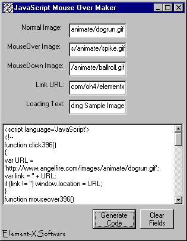



## JavaScript Mouse Over Code Generator

### Description

This code will create the code for a java script mouse over. You put in the starting image, mouse over image, click image, loading text, and link url and it generates all the code for you. All you have to do is cut and past to your web site.
 
### More Info
 

             |
---                |---
**Submitted On**   |2000-10-18 23:05:50
**By**             |[Element\-X Software Productions](https://github.com/Planet-Source-Code/PSCIndex/blob/master/ByAuthor/element-x-software-productions.md)
**Level**          |Beginner
**User Rating**    |4.3 (13 globes from 3 users)
**Compatibility**  |VB 6\.0
**Category**       |[Internet/ HTML](https://github.com/Planet-Source-Code/PSCIndex/blob/master/ByCategory/internet-html__1-34.md)
**World**          |[Visual Basic](https://github.com/Planet-Source-Code/PSCIndex/blob/master/ByWorld/visual-basic.md)
**Archive File**   |[CODE\_UPLOAD1076610182000\.zip](https://github.com/Planet-Source-Code/element-x-software-productions-javascript-mouse-over-code-generator__1-12138/archive/master.zip)

